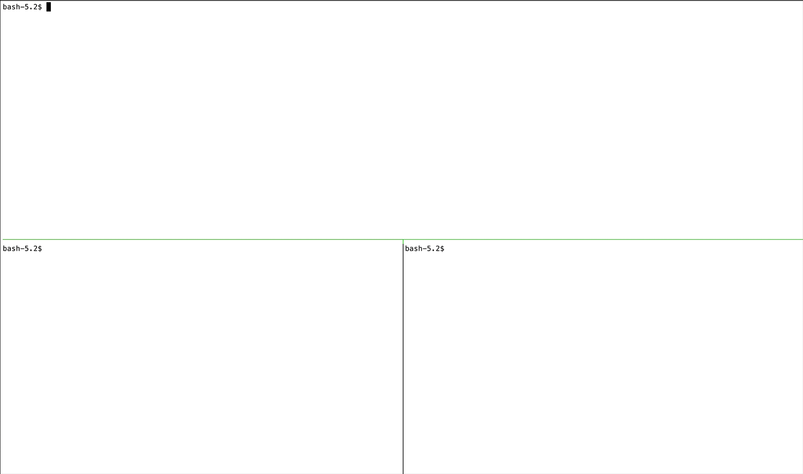

# Cluster RFQ

A simple RFQ cluster and command line client built using [Adaptive's Aeron Cluster QuickStart](https://github.com/AdaptiveConsulting/aeron-io-samples).

# Runtime requirements

- Linux/macOS (if you want to run the samples in your local environment; windows currently untested)
- Docker Compose 2.x - see [docker readme](docker/readme.md) for more details
- Kubernetes 1.26.x  - see [kubernetes readme](kubernetes/readme.md) for more details
- Minikube 1.31.x - if running Kubernetes with minikube. See [kubernetes readme](kubernetes/readme.md) for more details
